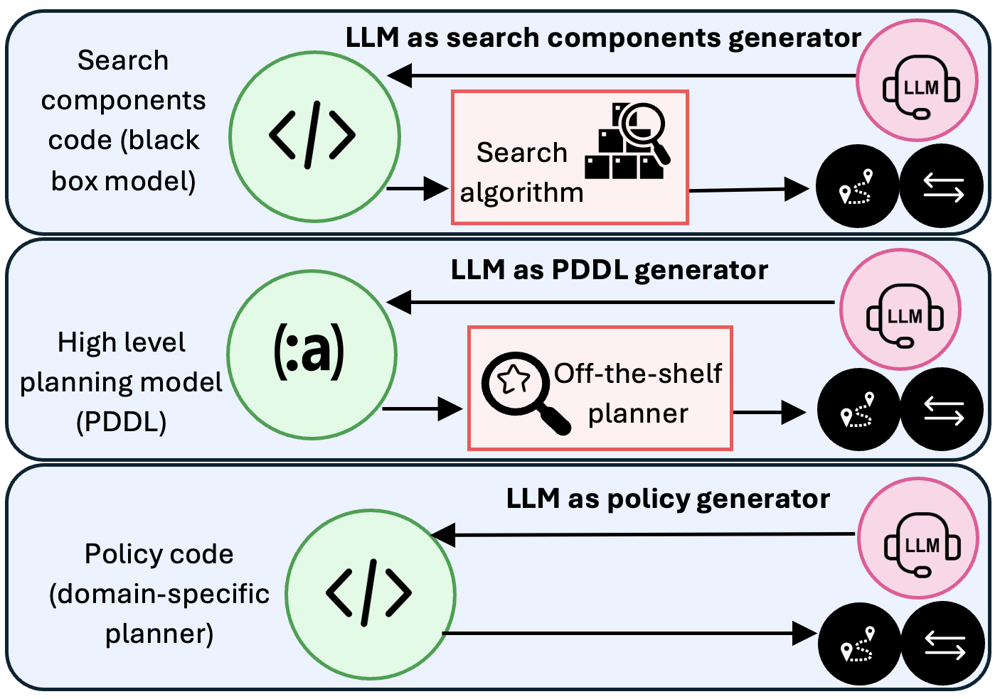

# Planning in the LLM Era: Build the Planner, Not Just the Plan

> "Planning is the art and practice of thinking before acting: of reviewing the courses of action one has available and predicting their expected (and unexpected) results to be able to choose the course of action most beneficial with respect to one's goals."
>
> Patrik Haslum, PhD Thesis, 2006

This description captures something essential about planning: considering possible actions and their consequences before committing to one. But the rise of large language models raises a harder question. When an LLM produces a plan, is it solving the problem at hand, or is it drawing on plans and procedures encountered during training?

The distinction matters because breadth is not the same as domain independence.

Traditional domain-independent planners operate over explicit models. Given actions, an initial state, and a goal, they search for a solution to a new problem instance. Language models derive much of their apparent generality from having absorbed an enormous range of domains during training. They can often produce plausible plans in familiar settings, but their performance is less reliable when problems require systematic exploration or differ substantially from the training distribution.

In our paper, [*Planning in the LLM Era: Building for Reliability and Efficiency*](../../papers/katz-et-al-icaps2026.pdf), we argue that the most promising role for LLMs may therefore not be to generate individual plans. It may be to generate **reusable planners**.

## The problem with solving every instance from scratch

Early work on LLM-based planning treated each problem independently. The model received a problem and generated a complete plan, often in a single call. These methods achieved limited success on simple cases but struggled when solutions required substantial search, reconsideration of earlier choices, or generalization to unseen instances.

This led naturally to approaches that wrap search, backtracking, or repeated self-correction around the language model — using LLM calls to obtain successors, check whether a state is a goal, or estimate how far it is from the goal — including Tree of Thoughts, Graph of Thoughts, and Algorithm of Thoughts.

But planning search makes an enormous number of calls to operations such as successor generation, goal testing, and heuristic evaluation. Implementing these operations as LLM calls is prohibitively expensive. To remain practical, LLM-based approaches heavily restrict search depth, width, or frontier size. As analyzed in [*Thought of Search*](../../papers/neurips2024.pdf), recent trends abandon both soundness and completeness for the sake of inefficiency.

There is also a more basic inefficiency: the work is discarded after each instance.

The next problem from the same domain starts over. The model again reconstructs the relevant dynamics, explores alternatives, and pays the full inference cost. Nothing resembling a maintained planner is produced.

This is particularly difficult to justify for hard planning problems. Such problems are rarely isolated one-off events. Manufacturing, logistics, workflow management, robotics, web interaction, and enterprise operations all involve families of related instances. Initial states and goals change, but much of the underlying structure remains stable.

**If a problem is hard enough to justify substantial modeling, search, and verification, that investment should usually be reused.**

## Why Runtime Plan Generation Does Not Scale

The appeal of direct plan generation is obvious: provide a description of the task and let the model produce a sequence of actions. For simple problems, this can work surprisingly well. The difficulty is that realistic planning domains are not simple.

As domains grow, actions acquire applicability conditions, consume resources, interact with one another, and produce effects that may only become relevant many steps later. In such settings, valid plans occupy only a tiny fraction of the possible action sequences. Most candidate plans violate some constraint, achieve goals in the wrong order, exhaust resources, or create conflicts that become visible only after extended execution.

Verification can detect many of these failures. However, detecting that a plan is wrong is fundamentally different from constructing a correct one. A verifier can reject invalid plans, but it rarely provides enough information to directly synthesize a valid replacement. The underlying challenge remains a search problem: identifying one of the few action sequences that satisfy all requirements simultaneously.

This distinction becomes increasingly important as problem complexity grows. Better language models may generate better candidate plans, but they do not eliminate the combinatorial structure of the search space. The central question is therefore not how to make the model generate plans more fluently, but how to use the model to construct reusable mechanisms that can systematically navigate that search space.

## Move the LLM from inference time to construction time

The alternative is to use the LLM at **solution-construction time** rather than repeatedly at inference time.

Instead of asking:

> Can the LLM solve this instance?

we should ask:

> Can the LLM construct a solver that handles this family of instances?

The resulting artifact may be a search procedure, a formal planning model, a heuristic, a generalized policy, or a combination of these. It can be tested on held-out instances, inspected, improved, maintained, and deployed without repeatedly invoking the language model.

This shift changes the role of the LLM. It is no longer expected to be the planner. It becomes a generator of planning machinery.

*Figure 1: Overview of planner generation methods across three paradigms: generating search components (NL2Search), generating formal planning models (NL2PDDL), and generating domain-specific policies (NL2Policy).*

Our paper examines three emerging versions of this idea.

## 1. Generate search-based planners and programmatic world models

The first direction, which we call **NL2Search**, uses LLMs to generate executable implementations of search components.

At its core, any search algorithm relies on a **world model**—an explicit mechanism that defines how world states are structured, how actions transition between states, and when a goal is reached:

- **State representation**: how world states are structured and encoded;
- **Transition dynamics / Successor function** (`succ`): computing valid next states given possible actions;
- **Goal test** (`is_goal`): verifying whether a state satisfies the termination conditions;
- **Heuristic evaluation** (`h`): estimating the remaining distance from a state to the goal.

In standard LLM-centric agent architectures (such as Tree of Thoughts or RAP), the LLM itself is queried at runtime to act as an implicit world model simulator. However, querying a neural network at every node expansion is cripplingly slow and expensive, forcing systems to artificially truncate search depth and sacrifice completeness.

Rather than running the LLM as a runtime simulator, [**Thought of Search (ToS)**](../../papers/neurips2024.pdf) uses the LLM at construction time to generate an executable, **programmatic world model** (e.g., in Python). Once the transition dynamics (`succ`) and goal condition (`is_goal`) are synthesized into standalone code, standard blind search algorithms (BFS, DFS, IDDFS, etc.) can run thousands of state transitions per second without a single LLM call. [**AutoToS**](../../papers/cao-et-al-icaps2026.pdf) automates this pipeline end-to-end, employing generic and domain-specific tests, validator feedback, and iterative reflection to synthesize sound and complete programmatic world models.

Recent work extends this to generating domain-specific heuristic functions (`h`), enabling informed search algorithms like A* and GBFS. In all these cases, the principle is identical: **use the language model to synthesize the world model and search machinery once, then let classical search explore the state space at native execution speeds.**

The major open frontier is automatic state abstraction. While ToS and AutoToS synthesize transition dynamics and goal tests from given state structures, extracting the right state variables, action abstractions, and observational invariants directly from unstructured text or interactive environments remains a central challenge. This challenge closely mirrors the classic separation between task and motion planning (TAMP): determining the appropriate discrete symbolic abstraction (objects, predicates, high-level actions) over continuous, low-level execution spaces is essential for scalable reasoning.

## 2. Generate formal planning models

A second direction, **NL2PDDL**, uses LLMs to translate natural-language task descriptions into formal planning models that can be solved by existing domain-independent planners.

This creates an attractive division of labor:

- the LLM handles natural language and broad domain knowledge;
- the planning model exposes the assumed dynamics;
- an established planner performs the search.

It also allows the system to exploit decades of research on efficient planning algorithms rather than recreating planning through language-model inference.

Several systems explore this direction. [*Large Language Models as Planning Domain Generators*](../../papers/icaps2024a.pdf) evaluates generated domains through their operational semantics, comparing the sets of plans they permit. [NL2Plan](https://arxiv.org/abs/2405.04215) incrementally extracts the information needed to construct a complete PDDL task from a minimal textual description. A recent [survey of LLMs as planning formalizers](https://arxiv.org/abs/2503.18971) organizes this growing body of work and its open challenges.

However, syntactically valid PDDL is not necessarily a correct model. A generated domain may contain missing preconditions, incorrect effects, invalid invariants, or unintended behaviors. Validating a plan against such a model does not establish that the model accurately reflects the intended domain dynamics.

Recent work by Oswald et al. ([*Model Space Reasoning as Search in Feedback Space for Planning Domain Generation*](../../papers/oswald-et-al-iclr2026wswm.pdf)) demonstrates how to address this: treating domain generation as **heuristic search over model and feedback space**. Rather than accepting a single LLM generation or following simple linear prompt repair, the system searches through candidate domain revisions guided by symbolic feedback—including plan validation with VAL and **fact/action landmarks** extracted from ground-truth task specifications. This moves knowledge engineering from blind prompting toward systematic exploration, testing, and automated repair of operational semantics.

## 3. Generate generalized policies

The third direction, **NL2Policy**, asks the LLM to generate executable code that solves an entire family of planning problems.

This is closely connected to generalized planning. Instead of computing a separate plan for each instance, the result is a policy or program that maps states to actions and can be evaluated across many instances.

[*Generalized Planning in PDDL Domains with Pretrained Large Language Models*](../../papers/aaai2024a.pdf) demonstrated that an LLM can synthesize Python programs intended to solve unseen tasks from the same domain, with automated debugging against training instances.

However, a fundamental vulnerability of that early paradigm was its reliance on generating a free-form natural language strategy in a single shot and immediately translating it into code. If the high-level strategy was flawed, subsequent Python debugging could not fix the underlying conceptual failure.

Recent work by Stein et al. ([*Improved Generalized Planning with LLMs Through Strategy Refinement and Reflection*](../../papers/stein-et-al-icaps2026.pdf)) resolves this by decoupling **strategy synthesis** from **code implementation**:
- **Structured Pseudocode Strategies**: Rather than vague natural-language text, the strategy is generated as structured, algorithmic pseudocode with explicit loops and branch logic.
- **Pre-Implementation Validation & Reflection**: The pseudocode strategy is validated on example tasks *before* Python code generation. When errors occur, a reflection step prompts the LLM to pinpoint the exact failure in the strategy and iteratively refine the pseudocode.
- **Ensemble Exploration & Program Selection**: Multiple candidate program variants are generated and debugged with reflection, selecting the best-performing generalized plan across held-out benchmark instances.

Policy code offers distinctive advantages in realistic agent settings: it can express loops, conditionals, API interactions, error handling, information gathering, and procedural glue code that fit awkwardly into classical planning languages. It also defines reusable hierarchical components for authentication, retrieval, filtering, payment processing, navigation, and other recurring subtasks. With structured strategy refinement and reflection, generalized planning scales to arbitrary problem sizes with near-zero runtime inference overhead.

## The three directions should not remain separate

NL2Search, NL2PDDL, and NL2Policy are complementary.

Generated policy code may implement high-level procedural behavior, while generated search components handle subproblems requiring combinatorial exploration. A generated planning model may provide explicit semantics against which search or policy behavior can be checked. Search components generated through NL2Search may themselves become inputs to model or policy generation.

Realistic systems will likely combine all three:

1. reusable policy code for familiar procedural structure;
2. explicit planning models where declarative semantics are valuable;
3. search for the parts of the problem that genuinely require exploration;
4. execution feedback for testing and revising the generated machinery.

The important architectural decision is not which single representation should win. It is that expensive and unreliable LLM computation should produce **persistent computational artifacts**, rather than disappear after every problem instance.

## Reliability requires reuse

Using an LLM at construction time does not automatically make the result reliable. Generated planners can still be incorrect. Generated models can misrepresent the domain. Generated policies can fail outside their tests.

But reusable artifacts make reliability attainable in a way that repeated natural-language generation does not.

A generated planner can be:

- tested systematically across instances;
- compared against trusted baselines;
- analyzed for soundness and completeness;
- profiled and optimized;
- versioned and maintained;
- independently validated;
- deployed without repeated LLM calls.

Reuse also changes the economics of verification. It is difficult to justify extensive validation of a plan generated for one instance. It is much easier to justify validating a solver that will be applied hundreds or thousands of times.

The comparison with instance-specific generation is revealing. Dynamic construction can be useful when a task is genuinely unique or does not belong to any recognizable family. But how often do we solve a hard planning problem only once? In most consequential applications, the domain recurs even when the individual instance does not. The cost of formalization and validation itself creates pressure toward reuse.

Instance-specific generation should therefore be treated as a fallback for novelty or an initial step toward identifying reusable structure, not as the default architecture for hard planning.

## The broader realignment

The central question for planning in the LLM era should not be whether increasingly large models can directly solve more benchmark instances.

That framing encourages expensive inference-time techniques, obscures the distinction between learned breadth and systematic generalization, and repeatedly discards useful computation.

A better question is:

> Can language models help us construct reliable, efficient, and maintainable planning systems for new problem families?

Under this view, language models contribute broad prior knowledge, programming ability, and access to natural-language specifications. Planning contributes explicit semantics, systematic search, validation, and reusable reasoning mechanisms.

Current agent architectures often treat every planning episode as a fresh reasoning problem. The model repeatedly reconstructs task dynamics, constraints, and solution strategies at inference time. In contrast, the approaches discussed here use LLMs to produce reusable planning machinery: search components, planning models, or domain-specific policies that can be validated, improved, and applied across many problem instances.

The long-term opportunity is therefore not merely to generate better plans, but to generate better planners. Planning in the LLM era should focus less on having a model reason through every new problem from scratch and more on using models to build explicit, executable, and verifiable mechanisms that can reason systematically for entire classes of problems.

The latter scales through reuse. The former does not.

## Further reading

- Michael Katz, Harsha Kokel, Kavitha Srinivas, and Shirin Sohrabi. [*Planning in the LLM Era: Building for Reliability and Efficiency*](../../papers/katz-et-al-icaps2026.pdf). ICAPS 2026.
- James Oswald, Daniel Obolensky, Volodymyr Varha, Vasilije Dragovic, Kavitha Srinivas, Harsha Kokel, Michael Katz, and Shirin Sohrabi. [*Model Space Reasoning as Search in Feedback Space for Planning Domain Generation*](../../papers/oswald-et-al-iclr2026wswm.pdf). ICLR 2026 Workshop on World Models.
- Michael Katz, Harsha Kokel, Kavitha Srinivas, and Shirin Sohrabi. [*Thought of Search: Planning with Language Models Through the Lens of Efficiency*](../../papers/neurips2024.pdf). NeurIPS 2024.
- Daniel Cao, Michael Katz, Harsha Kokel, Kavitha Srinivas, and Shirin Sohrabi. [*Automating Thought of Search: A Journey Towards Soundness and Completeness*](../../papers/cao-et-al-icaps2026.pdf). ICAPS 2026.
- James Oswald, Kavitha Srinivas, Harsha Kokel, Junkyu Lee, Michael Katz, and Shirin Sohrabi. [*Large Language Models as Planning Domain Generators*](../../papers/icaps2024a.pdf). ICAPS 2024.
- Elliot Gestrin, Marco Kuhlmann, and Jendrik Seipp. [*NL2Plan: Robust LLM-Driven Planning from Minimal Text Descriptions*](https://arxiv.org/abs/2405.04215). 2024.
- Marcus Tantakoun, Xiaodan Zhu, and Christian Muise. [*LLMs as Planning Formalizers: A Survey for Leveraging Large Language Models to Construct Automated Planning Models*](https://arxiv.org/abs/2503.18971). 2025.
- Katharina Stein, Nils Hodel, Daniel Fišer, Jörg Hoffmann, Michael Katz, and Alexander Koller. [*Improved Generalized Planning with LLMs Through Strategy Refinement and Reflection*](../../papers/stein-et-al-icaps2026.pdf). ICAPS 2026.
- Tom Silver, Soham Dan, Kavitha Srinivas, Joshua B. Tenenbaum, Leslie Pack Kaelbling, and Michael Katz. [*Generalized Planning in PDDL Domains with Pretrained Large Language Models*](../../papers/aaai2024a.pdf). AAAI 2024.
- Shirin Sohrabi, Haritha Ananthakrishnan, Harsha Kokel, Kavitha Srinivas, and Michael Katz. [*Learning and Reusing Policy Decompositions for Hierarchical Generalized Planning with LLM Agents*](../../papers/sohrabi-et-al-icaps2026wslm4plan.pdf). LM4Plan @ ICAPS 2026.
